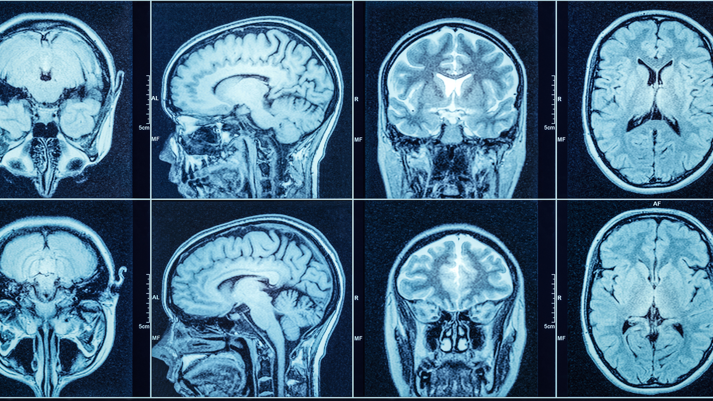

# Biomedical-Imaging-Extension
    

## Denoising and Enhancement of Brain MRI Images Using DSP Filtering Techniques. 
  * Objective：
    * The objective of this project is to improve the visual quality of brain MRI images by simulating different noise conditions, removing noise, and enhancing structural details using Digital Signal Processing (DSP) techniques in MATLAB. The aim is to enable clearer visualization of anatomical features, supporting improved diagnostic imaging
  * Background and Motivation: 
    * Magnetic resonance imaging (MRI) is an important tool for the diagnosis of neurological disorders. However, MRI images are often affected by Gaussian noise, motion artifacts, or acquisition-related distortions that may blur important anatomical structures. Therefore, we can reduce the noise by applying DSP-based filtering and enhancement techniques so that we can preserve critical details while ultimately improving the clarity and interpretability of the images for further analysis or segmentation.
    *  磁共振成像（MRI）是诊断神经系统疾病的重要工具。然而，核磁共振成像图像经常受到高斯噪声、运动伪影或采集相关失真的影响，可能会模糊重要的解剖结构。因此，我们可以通过应用基于 DSP 的滤波和增强技术来减少噪声，从而保留关键细节，最终提高图像的清晰度和可解释性，以便进一步分析或分割。
  * Scope of Work：
    * Import and preprocess publicly available brain MRI images.

      Simulate Gaussian and salt-and-pepper noise at varying intensities to evaluate the robustness of filters.

      Apply spatial domain filters (Gaussian, median, and Wiener) to denoise the images.

      Implement frequency domain enhancement techniques using FFT and high-pass filtering.

      Compare and visualize the results of different denoising and enhancement methods.

      Evaluate performance using quantitative metrics (SNR, PSNR) and qualitative visual inspection.
      
 * Methodology：
    * Using MATLAB and the Image Processing Toolbox. 

      Applying Spatial Filters 

      Gaussian filter for soft denoising. 

      Median filter for speckle or pretzel noise. 

      Wiener filter for adaptive filtering. 

      Apply frequency domain filters using FFT: 

      Remove low-frequency background noise. 

      Enhance edges using high-frequency emphasis. 

      Visualize using imshowpair, subgraphs, and more. 

      Optional: Add synthetic noise to compare the robustness of different methods.
* Expected Outcome  
     * This project will result in a MATLAB-based system that improves the quality of brain MRI through digital filtering techniques. Among other things, we can visualize comparisons          that will show which DSP method performs best under various noise conditions. Ultimately, the output will support a clearer visualization of brain structures, shedding light on         the preprocessing steps used in the medical imaging pipeline. It can help us to better understand the role of signal processing in medical imaging.
* Timeline 

      Week 3–4（-July 21）: Literature(paper) review, dataset download, and basic MATLAB setup. 

      Week 5（July 21-27): Implement denoising filters and FFT-based methods. 

      Week 6(July 28- August 3): Apply the way and finish the code part.  

      Week 7–8( August4-17): Test, compare results, and finalize report with visualizations.

  ####

  
  
  

  ### Citation:
  * https://www.researchgate.net/profile/Pierrick-Coupe/publication/337208936/figure/fig4/AS:824616847167489@1573615385441/Denoising-example-of-real-T1-and-T2-images-From-left-to-right-Noisy-image-filtered.jpg
  * https://swdic.com/services/
    
